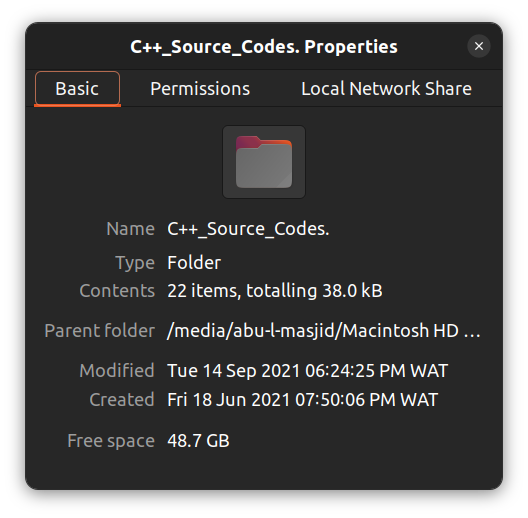

# C++ Codes Repository

## Overview

This repository is an archive of beginner-level C++ programming codes written during an introductory university course, CSC208 (C++ Computer Programming). The files cover foundational programming concepts and exercises, reflecting the learning journey through various basic C++ topics. Created and completed between Fri, 18th Jun 2021 and Tue, 14th Sep 2021.

---

## Structure

The repository is organized as follows:

- **`.vscode` folder**: Contains settings for the Visual Studio Code editor.  
- **C++ Source Files (`.cpp`)**: Individual files representing different topics and exercises, named descriptively for clarity:
  - `0.Lecture_Codes_1.cpp`, `0.Lecture_Codes_2.cpp`, etc. - Example lecture code files.  
  - `1.introduction.cpp`, `2.variable_output.cpp` - Basic concepts.  
  - `6.function_intro.cpp`, `8.void_functions.cpp` - Functions.  
  - `10.char.cpp`, `12.bool_data_type.cpp`, `16.strings-and-string-class.cpp` - Data types and strings.  
  - `15.numeric_functions.cpp` - Numeric operations.  

---

## Topics Covered

- Introduction to C++ syntax.  
- Variable declaration and input/output operations.  
- Functions and custom implementations.  
- Data types and their usage.  
- Strings and their manipulation.  
- Numeric operations and constant declarations.  
- Escape sequences and floating-point numbers.  

---

## Purpose

This repository is for archival and reference purposes, showcasing the basics of C++ programming as learned in the course. It may be useful for those new to programming or looking to review simple C++ concepts.  

---

## Screenshots

Here's a screenshots of the project folder properties:

---

## Notes

- These codes represent exercises and lecture materials from the course and are not intended for production use.  
- Some files, like `misc.cpp`, contain additional practice or experimental code.  

---

## License

This repository is shared without any specific license, as it primarily serves as an educational archive.  
